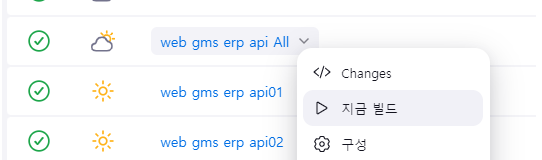

# 배포 프로세스
>   - Last update 2024-01-03


<br>

## 골프존 카운티 배포
 >- 담당자 카운티 : IT솔루션팀 김민석 매니저 minseak0801@golfzon.com
 >- Jenkins : http://jenkins.golfzoncounty.com/login
 >- ID : rnans13
 >- PW : skarnans1!
>
>
>- Git Lab : http://172.19.156.10:8088/
>- ID : kmnam
>- PW : skarnans1!

- jenkins, git lab 접속시 카운티 측 vpn 필요, 필요시 상기 담당자에게 요청 
- 추후 카운티측 깃 랩으로 소스 이전 해야함. 현재는 하기 코아측 Github에서 소스 관리 
  - https://github.com/golfzone/smartfield-front (코아)
  - https://github.com/golfzone/smartfield-api (코아)
  - 젠킨스 파이프라인에 코아측 깃 연결되어 있음, 젠킨스 설정 참조

- 배포 프로젝트

    | 프로젝트       |            배포 Jobs | QA서버           | jenkins job 연결된 Git                              |
    |---------------|--------------------:|------------------|--------------------------------------------------|
    | ERP API       |     web gms erp api | `API01`, `API02` | https://github.com/golfzone/smartfield-front.git |
    | ERP FRONT     |     web gms erp web | `WEB01`, `WEB02` | https://github.com/golfzone/smartfield-api.git   |
    | WEB           |      wgms_web_web01 | `WEB01`          | http://172.19.156.10:8088/web-gms/wgms-web.git   |
    | Mobile WEB    |                   - |                  |                                                  |
    | ADMIN         |                   - |                  |                                                  |
    | 오라           |                   - |                  |                                                  |
    | 선산           |                   - |                  |                                                  |

<br>

### **배포 방법**

1. 배포 **Branch** 최신화
   - web erp api,web
        ```shell
                #erp web, api
                1. git 레포지토리 이동
                2. $ git fetch // 깃 remote 최신화
                3. $ git checkout deploy-qa // 배포할 서버로 체크아웃
                4. $ git pull // 로컬 레포지토리 최신화
                5. $ git merge origin/develop //배포할 최신 코드 merge into deploy-qa
                6. $ git push // push local to remote        
        ```
   - web, mweb 프로젝트는 젠킨스에 master 브랜치가 배포 브랜치로 되어 있음, master에 최신 소스 최신화

<br>

2. 젠킨스 배포 job 실행 
    - http://jenkins.golfzoncounty.com/login
    - 관련 프로젝트 job 실행
    > <br>
    - 빌드는 하나씩, API 먼저, Front 나중에 배포 권장 (배포시 오류 최소화)

<br>
<Br>


### **배포시 주의 사항**

1. 배포 프로세스 중 프로젝트 내 Dockfile로 이미지 빌드
- ERP API 프로젝트, Dockfile
    ```dockerfile
    FROM openjdk:17-jdk-slim
    COPY build/libs/smartfield-api-0.0.1-SNAPSHOT.jar /app/smartfield-api-0.0.1-SNAPSHOT.jar
    WORKDIR /app
    CMD java -jar smartfield-api-0.0.1-SNAPSHOT.jar -Xms2048m -Xmx4096m --spring.profiles.active=qa
    ```
<br>

- 직영 WEB 프로젝트, Dockfile
    ```dockerfile
    FROM openjdk:8-jdk-alpine
    COPY holeInOne-0.0.1-SNAPSHOT.war /app/holeInOne-0.0.1-SNAPSHOT.war
    WORKDIR /app
    CMD java -jar holeInOne-0.0.1-SNAPSHOT.war -Xms2048m -Xmx4096m --spring.profiles.active=dev
    ```
- --spring.profiles.active={}로 프로퍼티로 서버별 설정 필요**배포시 주의 사항**
- 각 프로젝트에 맞는 도커파일 작성 필수.

<br><br>
### TODO

- 추후 Git Projects 코아 Github에서 카운티측 GitLab으로 변경 필요, 배포 프로세스 및 Git Flow 등 재논의 필요


----
