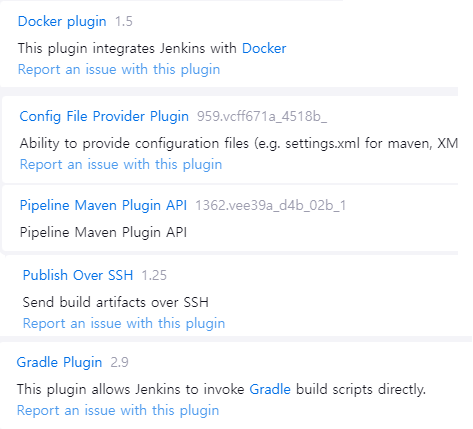
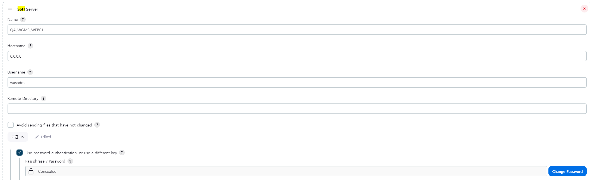
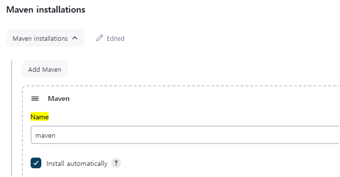
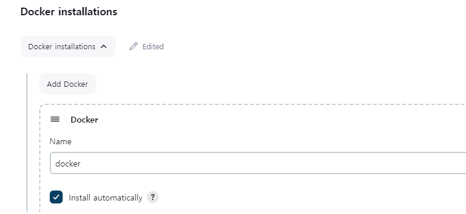
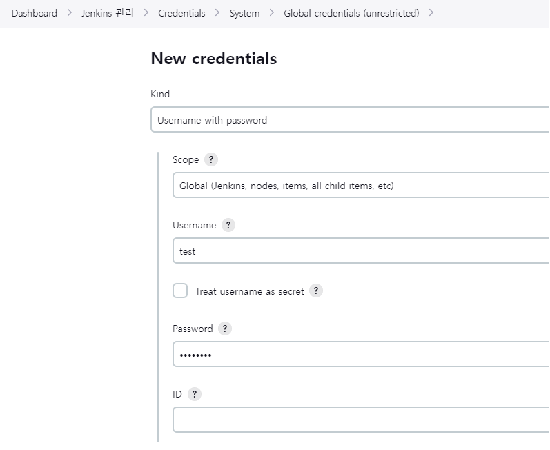
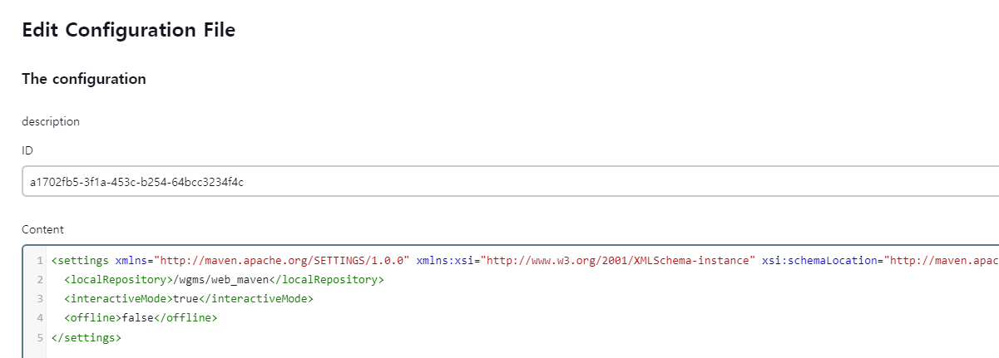

FORMAT: 1A
HOST: http://jenkins.golfzoncounty.com/

# **Jenkins CI/CD**
>   - Version 2.436

Jenkins를 통한 CI/CD 구축한 과정을 정리 공유 해보고자 합니다.
우선 이번 프로젝트에서 구축하려는 CI/CD 구조는 다음과 같습니다.

1. Git Lab 배포 브런치에 Push/Merge
2. Jenkins(docker container)에서 빌드 및 배포
    + git checkout
    + 프로젝트 빌드
    + war, jar 파일 도커 이미지 빌드
    + ssh을 통한 도커 이미지 파일 전송
    + 배포 서버에서 도커 컨테이너 생성 및 실행
    + 젠킨스 리소스 정리

Jenkins의 환경 설정부터 시작하여 CI/CD 구축 과정을 살펴보겠습니다.

<br><br><br>

## jenkins 설치

**1. 도커 설치 (Deploy 서버 환경에 맞게 설치, 예시는 AWS AML2)**

```shell
$ sudo yum install docker -y 
$ sudo service docker start // 도커 실행
$ sudo usermod -aG docker ec2-user // 필요에 따라 도커 권한 부여
```

**2. 컨테이너내 젠킨스 홈 폴더와 마운트 시킬 호스트 디렉토리 생성 및 권한 부여**

```shell
mkdir -p /docker/jenkins && chmod 666 /docker/jenkins
```

**3. 젠킨스 컨테이너 생성**
```shell
$ docker run -d --name jenkins -p 8080:8080 -v /docker/jenkins:/var/jenkins_home -v /usr/bin/docker:/usr/bin/docker -v /var/run/docker.sock:/var/run/docker.sock -u root [이미지 네임 or ID]
```

- ```-v /docker/jenkins:/var/jenkins_home```
    - 젠킨스 컨테이너의 설정을 호스트 서버와 공유함으로써, 컨테이너가 삭제되는 경우에도 설정을 유지할수 있게 해줌.
- ```-v /usr/bin/docker:/usr/bin/docker -v /var/run/docker.sock:/var/run/docker.sock```
    - 젠킨스 컨테이너에서도 호스트 서버의 도커를 사용하기 위한 바인딩.
- ```-p 8080:8080```
    - 젠킨스의 defaul port 인 8080 을 호스트 서버와 매핑. 
- 현재 구성된 젠킨스의 경우 **jenkins/jenkins:lts** 이미지를 기반으로 구성.

**4. 젠킨스 접속 및 계정 생성**

<br><br><br>

##  **젠킨스 구성**

+ **젠킨스 plugin 설치**

    1. jenkins 관리 > Plugins > Available Plugins > Docker plugin 설치
    2. jenkins 관리 > Plugins > Available Plugins > Publish Over SSH 설치
    3. jenkins 관리 > Plugins > Available Plugins > Config File Provider Plugin 설치
    4. jenkins 관리 > Plugins > Available Plugins > pipeline maven integration
    5. jenkins 관리 > Plugins > Available Plugins > Gradle Plugin
        -  젠킨스 버전에 따라 디폴트로 설치 되어 있을 수 있음<br><br>
        ><br>

<br><br>

## **Pipeline 사전 설정**
 **1. jenkins 관리 > Systems > Publish over SSH (plugin 설치) > 배포할 서버 private key 세팅**
  - **name**값 파이프라인에서 사용
><br>

<br>

 **2. jenkins 관리 > Tools > Gradle installations > 7.6 버전 설정**
- **name**값 파이프라인에서 사용
> <br>

<br>

 **3. jenkins 관리 > Tools > Maven installations > 3 버전 설정**
- **name**값 파이프라인에서 사용
> <br>

<br>

 **4. jenkins 관리 > Tools > Docker installations (plugin 설치) > 설정**
- **name**값 파이프라인에서 사용 
> <br>

<br>


<br>

 **5. jenkins 관리 > Credentials >  add Credentials (배포 프로젝트별 형상관리 계정 등록)**
- **ID**값 파이프라인에서 사용
> <br>


 **6. jenkins 관리 > Managed files(plugin 설치) > Add a new config  > Maven settings.xml **
 - 현재 카운티 웹 프로젝트 setting.xml sample
    ```xml
    <settings xmlns="http://maven.apache.org/SETTINGS/1.0.0" xmlns:xsi="http://www.w3.org/2001/XMLSchema-instance"
             xsi:schemaLocation="http://maven.apache.org/SETTINGS/1.0.0 http://maven.apache.org/xsd/settings-1.0.0.xsd">
       <localRepository>{컨테이너 내 메이븐 로컬 레포지토리 경로}</localRepository>
       <interactiveMode>true</interactiveMode>
       <offline>false</offline>
    </settings>
    ```
- 카운티 웹의 경우 메이븐 레포지토리를 젠킨스 컨테이너 내부 /wgms/web_maven에 위치
- **ID**값 파이프라인에서 사용
> <br>

<br><br><br>

## pipeline 구성

new item > Pipeline 생성 > pipeline 스크립트 작성

**Pipeline 변수 설정** 

```shell
def dockerImageName = "smartfield-api" // 이미지 빌드할 이름
def tagVersion = "0.0.1" // 이미지 빌드시 tag

def targetServer1 = "QA_WGMS_API01" // ssh 설정한 name값
def targetServer2 = "QA_WGMS_API02" // ssh 설정한 name값

def branch = "deploy-qa" // 배포할 branch
def gitCredentials = "github-signin" // jenkins credentials 설정한 id 값
def giturl = "https://github.com/golfzone/smartfield-api.git"  // Git repository 

def buildId = env.BUILD_ID   //jenkins 빌드 Id
def jobsName = env.JOB_NAME  //jenkins Job Name
```

**0. stage - Tool 정의**
```groovy
agent any
tools {
     gradle 'gradle'       // jenkins > tools > gradle name 값
     dockerTool 'docker'   // jenkins > tools > docker name 값
 }
```
<br>

**1. stage - 소스 최신화**
- 배포하려는 git branch로 git check out
```groovy
 stage('Checkout Git Branch') {
     steps {
        git branch: '{branch}', credentialsId: '{설정한 Credential Id 값}', url: '{git http url}'
     }
 }
```
<br>

**2. stage - 프로젝트 빌드**
- maven 프로젝트 빌드시 **pipeline maven** , **Config File Provider** 필요
```groovy
stage('gardle Build') {
    steps {
        sh 'chmod +x gradlew'
        sh './gradlew bootjar'
                or
       withMaven(maven: 'maven', mavenSettingsConfig: 'a1702fb5-3f1a-453c-b254-64bcc3234f4c') { 
           sh "mvn clean install "
       } 
}
```
<br>

**3. stage - 도커 이미지 빌드**
    - 도커파일 프로젝트 내 존재

          stage('Docker Image Build') {
              steps {
                 docker rmi -f {이미지명}  || true // 이미지 초기화
                 docker build --tag {이미지명} . // 이미지 빌드 Dockerfile 소스 코드 최상단에 위치
                 rm -f ./*  // 파일 초기화
                 docker save -o {파일명} {이미지명}   //이미지 파일 저장
              }
          }

<Br>

**4. stage - Deploy**
- ssh 파일 전송 및 각 서버 도커 이미지 교체 (publish over ssh 플러그인 사용)
```groovy 
configName: "{publish over ssh 설정한 값}"
```
```
execCommand :

    " docker stop {이미지 명} || true //기존 이미지 스탑 
    docker system prune -a -f // 기존 도커 리소스 정리
    cd /app && docker load -i {전송한 파일명}
    docker run -i -d -p {호스트 포트}:{컨테이너 포트} --name {생성할 컨테이너명} {사용할 이미지명}
    rm -f {전송한 파일}" // 파일 정리
```

**5. stage - 리소스 정리**
- 배포에 사용된 젠킨스 리소스 정리
```groovy
stage('Clean') {
    steps {
        sh "docker rmi -f {이미지명} || true" // 이미지 정리
        sh "rm -rf ./*"  // 파일 정리

        sh "rm -rf /var/jenkins_home/jobs/${jobsName}/builds/${buildId}/archive" //maven 프로젝트의 경우 jobs에 빌드 된 파일이 남아서 삭제 처리
    }
}
```
<br><br>

## 특이사항
+ 프로젝트 소스 최상단의 도커파일로 이미지 빌드함, 각 배포에 맞게 수정 필요 [[참고]](https://github.com/rnans13/jenkins/blob/aa008c4ec0923dde33f30aa001fe09cae64cdb19/배포%20프로세스.md#L44)
+ 프로세스 중 docker run 할 경우 포트 설정 주의, 호스트 포트는 외부에서 접근할 포트 <br> 컨테이너 포트는 가상 컨테이너 환경과 내부 서비스가 연결 되는 내부 포트
+ ERP의경우 Gradle 프로젝트로 구성
+ WEB의 경우 Maven 프로젝트로 구성
    - 빌드시 로컬 레포지토리 필요(2023-12-29 : 카운티 jenkins 컨테이너 > /wgms/web_maven)
+ 계속 추가 예정

<br><br>

---

<br>

> # 파이프라인 Sample

### wgms erp api

```groovy
def buildName = "smartfield-api-0.0.1-SNAPSHOT.jar"
def dockerImageName = "smartfield-api"
def tagVersion = "0.0.1"

def targetServer1 = "QA_WGMS_API01"
def targetServer2 = "QA_WGMS_API02"

def gradleProfile = "qa"

// def branch = "master"
// def gitCredentials = "gitlab-signin"
// def giturl = "http://172.19.156.10:8088/web-gms/wgms-api.git"

def branch = "deploy-qa"
def gitCredentials = "github-signin"
def giturl = "https://github.com/golfzone/smartfield-api.git"


def buildId = env.BUILD_ID
def jobsName = env.JOB_NAME

pipeline {
    agent any
        tools {
            gradle 'gradle'
            dockerTool 'docker'
        }
    stages {

        stage('Checkout Git Branch') {
            steps {
                git branch: branch, credentialsId: gitCredentials, url: giturl
            }
            post {
                failure {
                    echo 'Repository clone failure !'
                }
                success {
                    echo 'Repository clone success !'
                }
            }
        }

        stage('gardle Build') {
            steps {
                sh 'chmod +x gradlew'
                sh './gradlew bootjar'
            }
            post {
                failure {
                    echo 'Gradle build failure !'
                }
                success {
                    echo 'Gradle build success !'
                }
            }
        }

        stage('Docker Image Build') {
            steps {
                sh "docker rmi -f ${dockerImageName}:${tagVersion} || true"
                sh "docker build --tag ${dockerImageName}:${tagVersion} . --build-arg PROFILE=${gradleProfile} "
                sh "rm -f ./*"
                sh "docker save -o ${dockerImageName}.tar ${dockerImageName}"
            }
            post {
                failure {
                    echo 'Docker image build failure !'
                }
                success {
                    echo 'Docker image build success !'
                }
            }
        }
        stage('Deploy Server 01') {
            steps([$class: 'BapSshPromotionPublisherPlugin']) {
                sshPublisher(
                    continueOnError: true, failOnError: false,
                    publishers: [
                        sshPublisherDesc(
                            configName: "${targetServer1}",//Jenkins 시스템 정보에 사전 입력한 서버 ID
                            verbose: true,
                            transfers: [
                                sshTransfer(
                                    sourceFiles: "${dockerImageName}.tar", //전송할 파일
                                    removePrefix: "", //파일에서 삭제할 경로가 있다면 작성
                                    remoteDirectory: "/app", //배포할 위치
                                    execCommand: 
                                        "docker stop ${dockerImageName} || true && docker system prune -a -f && cd app && docker load -i ${dockerImageName}.tar && docker run -i -d -p 8080:80 -e TZ=Asia/Seoul --name ${dockerImageName} ${dockerImageName}:0.0.1 && docker ps && rm -f ${dockerImageName}.tar"
                                    )
                            ]
                        )
                    ]
                )
            }
        }
        stage('Deploy Server 02') {
            steps([$class: 'BapSshPromotionPublisherPlugin']) {
                sshPublisher(
                    continueOnError: true, failOnError: false,
                    publishers: [
                        sshPublisherDesc(
                            configName: "${targetServer2}",//Jenkins 시스템 정보에 사전 입력한 서버 ID
                            verbose: true,
                            transfers: [
                                sshTransfer(
                                    sourceFiles: "${dockerImageName}.tar", //전송할 파일
                                    removePrefix: "", //파일에서 삭제할 경로가 있다면 작성
                                    remoteDirectory: "/app", //배포할 위치
                                    execCommand: 
                                        "docker stop ${dockerImageName} || true && docker system prune -a -f && cd app && docker load -i ${dockerImageName}.tar && docker run -i -d -p 8080:80 -e TZ=Asia/Seoul --name ${dockerImageName} ${dockerImageName}:0.0.1 && docker ps && rm -f ${dockerImageName}.tar"
                                    )
                            ]
                        )
                    ]
                )
            }
        }
        stage('Clean') {
            steps {
                sh 'rm -rf ./*'
                sh 'rm -rf ./.git'
            }
            post {
                failure {
                    echo 'Docker image build failure !'
                }
                success {
                    echo 'Docker image build success !'
                }
            }
        }
        
    }
}
```

<br>

### wgms erp web

```groovy
def buildName = "smartfield-front-0.0.1-SNAPSHOT.jar"
def dockerImageName = "smartfield-front"
def tagVersion = "0.0.1"

def targetServer1 = "QA_WGMS_WEB01"
def targetServer2 = "QA_WGMS_WEB02"

def gradleProfile = "qa"

// def branch = "master"
// def gitCredentials = "gitlab-signin"
// def giturl = "http://172.19.156.10:8088/web-gms/wgms-front.git"

def branch = "deploy-qa"
def gitCredentials = "github-signin"
def giturl = "https://github.com/golfzone/smartfield-front.git"


def buildId = env.BUILD_ID
def jobsName = env.JOB_NAME

pipeline {
    agent any
        tools {
            gradle 'gradle'
            dockerTool 'docker'
        }
    stages {

        stage('Checkout Git Branch') {
            steps {
                git branch: branch, credentialsId: gitCredentials, url: giturl
            }
            post {
                failure {
                    echo 'Repository clone failure !'
                }
                success {
                    echo 'Repository clone success !'
                }
            }
        }

        stage('gardle Build') {
            steps {
                sh 'chmod +x gradlew'
                sh './gradlew bootjar'
            }
            post {
                failure {
                    echo 'Gradle build failure !'
                }
                success {
                    echo 'Gradle build success !'
                }
            }
        }

        stage('Docker Image Build') {
            steps {
                sh "docker rmi -f ${dockerImageName}:${tagVersion} || true"
                sh "docker build --tag ${dockerImageName}:${tagVersion} . --build-arg PROFILE=${gradleProfile} "
                sh "rm -f ./*"
                sh "docker save -o ${dockerImageName}.tar ${dockerImageName}"
            }
            post {
                failure {
                    echo 'Docker image build failure !'
                }
                success {
                    echo 'Docker image build success !'
                }
            }
        }
        stage('Deploy Server 01') {
            steps([$class: 'BapSshPromotionPublisherPlugin']) {
                sshPublisher(
                    continueOnError: true, failOnError: false,
                    publishers: [
                        sshPublisherDesc(
                            configName: "${targetServer1}",//Jenkins 시스템 정보에 사전 입력한 서버 ID
                            verbose: true,
                            transfers: [
                                sshTransfer(
                                    sourceFiles: "${dockerImageName}.tar", //전송할 파일
                                    removePrefix: "", //파일에서 삭제할 경로가 있다면 작성
                                    remoteDirectory: "/app", //배포할 위치
                                    execCommand: 
                                        "docker stop ${dockerImageName} || true && docker system prune -a -f && cd app && docker load -i ${dockerImageName}.tar && docker run -i -d -p 8080:80 -e TZ=Asia/Seoul --name ${dockerImageName} ${dockerImageName}:0.0.1 && docker ps && rm -f ${dockerImageName}.tar"
                                    )
                            ]
                        )
                    ]
                )
            }
        }
        stage('Deploy Server 02') {
            steps([$class: 'BapSshPromotionPublisherPlugin']) {
                sshPublisher(
                    continueOnError: true, failOnError: false,
                    publishers: [
                        sshPublisherDesc(
                            configName: "${targetServer2}",//Jenkins 시스템 정보에 사전 입력한 서버 ID
                            verbose: true,
                            transfers: [
                                sshTransfer(
                                    sourceFiles: "${dockerImageName}.tar", //전송할 파일
                                    removePrefix: "", //파일에서 삭제할 경로가 있다면 작성
                                    remoteDirectory: "/app", //배포할 위치
                                    execCommand: 
                                        "docker stop ${dockerImageName} || true && docker system prune -a -f && cd app && docker load -i ${dockerImageName}.tar && docker run -i -d -p 8080:80 -e TZ=Asia/Seoul --name ${dockerImageName} ${dockerImageName}:0.0.1 && docker ps && rm -f ${dockerImageName}.tar"
                                    )
                            ]
                        )
                    ]
                )
            }
        }
        stage('Clean') {
            steps {
                sh "docker rmi -f ${dockerImageName}:${tagVersion} || true"
                sh 'rm -rf ./*'
                sh 'rm -rf ./.git'
            }
            post {
                failure {
                    echo 'Docker image build failure !'
                }
                success {
                    echo 'Docker image build success !'
                }
            }
        }

    }
}
```

<br>

### wgms web

```groovy
def buildName = "holeinone-0.0.1-SNAPSHOT.war"
def dockerImageName = "holeinone-kiosk"
def tagVersion = "0.0.1"
def targetServer = "QA_WGMS_WEB01"

def branch = "master"
def gitCredentials = "gitlab-signin"
def giturl = "http://172.19.156.10:8088/web-gms/wgms-kiosk.git"

def buildId = env.BUILD_ID
def jobsName = env.JOB_NAME

pipeline {
    agent any
    tools {
        dockerTool 'docker'
    }
    stages {
        stage('Checkout Git Branch') {
            steps {
                git branch: branch, credentialsId: gitCredentials, url: giturl
            }
            post {
                failure {
                    echo 'Git checkout failure !'
                }
                success {
                    echo 'Git checkout success !'
                }
            }
        }

        stage('maven Build') {
            steps {
                withMaven(maven: 'maven', mavenSettingsConfig: 'a1702fb5-3f1a-453c-b254-64bcc3234f4c') {
                    sh "mvn clean install "
                }
                sh "mv ./target/holeInOne-0.0.1-SNAPSHOT.war ./ || true"
                sh "rm -rf ./src"
                sh "rm -rf ./target"
            }
            post {
                failure {
                    echo 'maven build failure !'
                }
                success {
                    echo 'maven build success !'
                }
            }
        }

        stage('Docker Image Build') {
            steps {
                sh "docker rmi -f ${dockerImageName}:${tagVersion} || true"
                sh "docker build --tag ${dockerImageName}:${tagVersion} . "
                sh "rm -rf ./* || true"
                sh "docker save -o ${dockerImageName}.tar ${dockerImageName}"
            }
            post {
                failure {
                    echo 'Docker image build failure !'
                }
                success {
                    echo 'Docker image build success !'
                }
            }
        }
        stage('SSH transfer') {
            steps([$class: 'BapSshPromotionPublisherPlugin']) {
                sshPublisher(
                        continueOnError: true, failOnError: false,
                        publishers: [
                                sshPublisherDesc(
                                        configName: "${targetServer}",//Jenkins 시스템 정보에 사전 입력한 서버 ID
                                        verbose: true,
                                        transfers: [
                                                sshTransfer(
                                                        sourceFiles: "${dockerImageName}.tar", //전송할 파일
                                                        removePrefix: "", //파일에서 삭제할 경로가 있다면 작성
                                                        remoteDirectory: "/app", //배포할 위치
                                                        execCommand:
                                                                "docker stop ${dockerImageName} || true && docker system prune -a -f && cd app && docker load -i ${dockerImageName}.tar && docker run -i -d -p 8050:8082 -e TZ=Asia/Seoul --name ${dockerImageName} ${dockerImageName}:0.0.1 && docker ps && rm -f ${dockerImageName}.tar"
                                                )
                                        ]
                                )
                        ]
                )
            }
        }
        stage('Clean') {
            steps {
                sh "rm -rf ./.git"
                sh "rm -rf ./*"
                sh "rm -rf /var/jenkins_home/jobs/${jobsName}/builds/${buildId}/archive"
            }
            post {
                failure {
                    echo 'Docker image build failure !'
                }
                success {
                    echo 'Docker image build success !'
                }
            }
        }

    }
}
```

Todo
<!--- 배포 트리거 설정(2023-12-18)-->
<!--- 무중단 배포 (2023-12-18)-->
